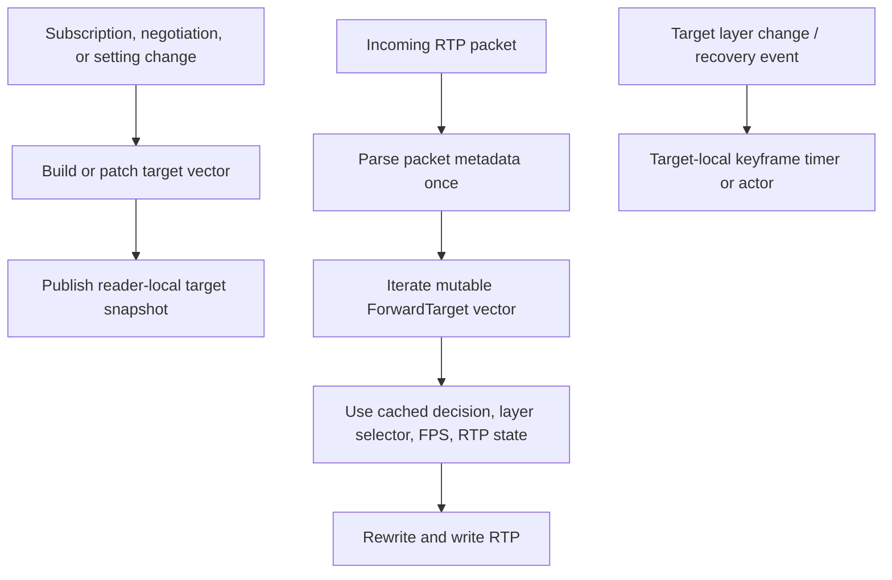

# Forwarding hot-path performance plan

_This document serves as a kind of memory for an LLM on how to continue with performance optimization._

## Status

**Phase 1 complete; further optimization is optional and evidence-driven.** The large simulcast forwarding workloads are functionally healthy and the latest two-round mixed high-simulcast comparison is within 5% CPU of the upstream Go LiveKit reference.

This plan records the evidence, reference behavior, target architecture, staged implementation plan, and completion gates for closing that gap without weakening LiveKit compatibility.

## Problem statement

The benchmark suite compares an upstream Go LiveKit server with OxideSFU under `lk perf load-test`. The large simulcast scenarios are the current CPU outliers:

| Scenario | LiveKit median CPU | OxideSFU median CPU | Observed delta |
|---|---:|---:|---:|
| `video_room_high_simulcast_large` | 3.67 s | 4.51 s | +22.9% |
| `mixed_room_high_simulcast_large` | 7.33 s | 9.54 s | +30.2% |

The workload shapes in `crates/oxidesfu-test/src/benchmark/load.rs` are:

| Scenario | Duration | Video publishers | Audio publishers | Subscribers | Layout | Resolution | Simulcast |
|---|---:|---:|---:|---:|---|---|---|
| `video_room_high_simulcast_large` | 30 s | 3 | 0 | 18 | `3x3` | high | enabled |
| `mixed_room_high_simulcast_large` | 30 s | 4 | 4 | 20 | speaker | high | enabled |

Wall-clock completion remains close to the Go reference and peak RSS is lower. The issue is CPU efficiency in the high-fanout video forwarding path, not a correctness failure or an end-to-end latency regression proven by these artifacts.

## Evidence collected

### Benchmark history

The earlier two-run comparison was above the benchmark's configured 25% CPU regression gate:

```text
OxideSFU median CPU: 9.53 s
LiveKit median CPU:  6.97 s
Gate:                 8.71 s
```

After the reader-local target-state refactor, a fresh two-run comparison completed within the gate:

```text
OxideSFU median CPU: 7.87 s
LiveKit median CPU:  7.53 s
Delta:                +4.5%
OxideSFU peak RSS: 108.95 MiB (Go: 204.54 MiB; -46.7%)
```

These limited samples are useful directionally but are not a stable capacity claim. Use at least five runs on an otherwise idle host for acceptance decisions.

### CPU profiles

The repository-owned runner captures a profileable OxideSFU server and the exact `lk` workload:

```sh
tools/profiling/profile-load-test.sh mixed_room_high_simulcast_large
```

The successful runs delivered all 160 subscriber tracks with effectively zero packet loss. The top-level `perf` samples moved as the first forwarding fixes landed:

| Sampled symbol | Initial profile | After revision-scoped cleanup | After target-bound RTP state | Latest rerun (`8a59e987`) |
|---|---:|---:|---:|---:|
| `core::hash::sip::Hasher::write` | 12.65% | 7.13% | 6.51% | 0.88% |
| `__vdso_clock_gettime` | 3.20% | 3.03% | 2.74% | 3.12% |
| WebRTC peer-connection write path | 2.38% | 2.41% | 2.64% | 1.21% (`poll_write_pipeline`) |
| WebRTC driver loop | — | — | — | 1.90% |
| forwarding reader closure | 1.11% | 2.16% | 1.70% | 0.92% |
| `BuildHasher::hash_one` | — | — | 1.16% after reader-local target state | 0.87% |

The latest rerun (`mixed_room_high_simulcast_large-20260715T211139Z-8a59e987`) delivered `160/160` tracks with a single lost packet overall (rounded `0%`) and 27K samples with zero lost perf samples. The leading symbols remain below the forwarding policy layer (`__vdso_clock_gettime`, WebRTC driver loop, RTC poll-write pipeline, and kernel epoll wakeups), so no additional global forwarding-map rewrite is justified by this profile alone.

Representative artifacts are deliberately ignored under `target/profiles/`; reproduce them rather than committing binary profiling data.

### 2026-07-15: current-revision scenario coverage

A 60-second Oxide-only profile pass at `869d6d44` covered the three medium presets and the high video-only companion. All runs retained every expected track with zero reported packet loss. These are hotspot-mapping runs, not CPU-capacity comparisons: the profile runner records only OxideSFU, and sample counts vary with each workload's actual CPU use.

| Scenario | Delivery | Samples | Leading shared samples |
|---|---:|---:|---|
| `video_room_high_simulcast_large` | 54/54 | 4K | VDSO 1.83%, driver loop 1.51%, epoll 1.18%, RTC `poll_event` 0.94% |
| `audio_fanout_medium` | 48/48 | 10K | VDSO 2.57%, driver loop 2.26%, epoll 1.25%, spinlock 1.10%, AES-GCM 1.03%, RTC write 0.95% |
| `livestream_medium` | 20/20 | 9K | VDSO 2.62%, driver loop 2.24%, epoll 1.38%, RTC write 1.33% |
| `mixed_room_medium` | 40/40 | 7K | VDSO 2.11%, driver loop 1.60%, epoll 1.15%, RTC write 0.81% |
| `mixed_room_high_simulcast_large` (latest LAN-address run) | 160/160 | 34K | VDSO 3.04%, driver loop 2.08%, epoll 1.35%, spinlock 1.31%, RTC write 1.13%, AES-GCM 0.98% |

The generated paired benchmark overview currently shows Rust faster in CPU time for every real scenario except `mixed_room_high_simulcast_large` (Go 7.100s → OxideSFU 8.500s, +19.7%). The profile matrix therefore does **not** support another general forwarding-map optimization: the regression is specific to the high mixed scale (four high simulcast video publishers, four audio publishers, and 20 subscribers), where the shared per-packet driver/timing/transport costs accumulate.

A paired five-second smoke sweep completed all five one-factor points with every expected track and zero loss, but it exposed an important comparability limit: Go and OxideSFU did not deliver equivalent video bitrate in that short warm-up window. At the `4V/4A/20S` baseline, Go delivered 67.1Mbps aggregate versus OxideSFU 42.6Mbps; at `4V/0A/20S`, Go delivered 65.4Mbps versus OxideSFU 34.1Mbps. Audio-only was close (1.3Mbps Go versus 1.5Mbps OxideSFU).

A second paired 20-second sweep confirmed that this is not only the five-second connection burst. Every point again delivered all tracks with zero loss, and audio-only remained matched (Go 1.6Mbps, OxideSFU 1.6Mbps). Video-bearing points still diverged: baseline `4V/4A/20S` was Go 57.5Mbps versus OxideSFU 43.7Mbps; video-only `4V/0A/20S` was 57.0Mbps versus 27.5Mbps; `4V/4A/15S` was 44.6Mbps versus 16.3Mbps; and `4V/4A/10S` was 28.8Mbps versus 9.9Mbps. The varying ratio implies subscriber/video-layer policy or convergence behavior, not merely a constant encryption or UDP cost.

The 20-second baseline has 7K Go and 9K OxideSFU samples with no loss. Go exposes `pkg/sfu.(*DownTrack).WriteRTP` (1.32%) beneath runtime scheduling/GC; OxideSFU exposes VDSO (2.72%), WebRTC driver event loop (1.86%), kernel spinlock/epoll (2.89% combined), Tokio worker scheduling (1.37%), RTC write pipeline (1.07%), AEAD (0.97%), and hashing (0.90% plus `hash_one` 0.80%). These flat shares are only implementation-local candidates because media bitrate is not normalized. Do not compare them as equal-work CPU percentages.

The next live investigation must report post-warm-up per-track bitrate and simulcast layer distributions for Go and OxideSFU. If the divergence remains, investigate simulcast quality/layer convergence before changing shared driver or transport code. Only after normalizing delivered media should the full one-factor matrix be used for performance attribution.

### Findings

The original forwarding reader held several parallel maps indexed by:

```rust
(String, String, String, String)
// room, publisher identity, track SID, subscriber identity
```

It performed membership cleanup, target state lookup, settings revision lookup, and keyframe timing work on media packets. This caused repeated secure hashing, string cloning, map probing, and lock acquisition in the steady RTP path.

The first optimization commit, `55e7751d` (`perf: scope forwarding state to target revisions`), made these changes:

1. Target-state cleanup occurs only when `ForwardTrackStore::revision()` changes.
2. Per-target settings revisions are queried only for new targets or a new global settings generation.
3. The forwarding snapshot stores a `SubscriberRtpForwarder`, avoiding the global `RtpForwardingStore` map lookup for each forwarded RTP packet.
4. Keyframe recovery remains periodic, but target scans occur on target change or a once-per-three-second per-track sweep rather than every video packet.

The implementation initially removed periodic keyframe recovery completely. The real Rust SDK quality-switch contract failed, proving that retries are compatibility behavior, not merely diagnostics. The final design retained throttled recovery.

## Reference map

Reference checkout used: local LiveKit server commit `ae09b7d0ad94d764f0c97d183efd36476163e819`.

### LiveKit server

| Area | Reference files | Behavior derived |
|---|---|---|
| Subscription settings | `pkg/rtc/subscriptionmanager.go`, `pkg/rtc/subscribedtrack.go` | Settings are routed to the individual subscription, compared/debounced, and applied out of band. Applying settings mutates that track's mute and spatial/temporal layer target. |
| Per-subscriber forwarding | `pkg/sfu/downtrack.go`, `pkg/sfu/forwarder.go` | Each subscription has one `DownTrack` and local `Forwarder`; media forwarding uses that target-local state rather than resolving a global compound-key map on every RTP packet. |
| Keyframe recovery | `pkg/sfu/downtrack.go` | Each video DownTrack owns a channel/timer-driven keyframe requester. Layer changes signal the worker; retry cadence is bounded using RTT-derived timing. |
| Packet lifecycle | `pkg/sfu/downtrack.go`, `pkg/sfu/buffer/buffer_base.go`, `pkg/sfu/pacer/base.go` | Ext-packet wrappers, RTP headers, payload buffers, and pacer packets are pooled. Packet sending returns borrowed resources to their pools. |

### Pion WebRTC

Reference checkout: `webrtc_pion/` in this workspace.

| Area | Reference files | Behavior derived |
|---|---|---|
| Local RTP write | `track_local_static.go` | `TrackLocalStaticRTP::WriteRTP` obtains a pooled packet and iterates its negotiated bindings under a track-local read lock. Each binding already contains SSRC, payload type, and write stream. |
| Interceptor dispatch | `interceptor.go` | The RTP writer is held in an atomic value and forwards a header/payload directly through the interceptor chain. |
| Transport write | `dtlstransport.go` | Transport owns SRTP/SRTCP sessions and write streams; packet-level consumers should not re-resolve transport identity. |

### Derived rule

Use Go/LiveKit as the behavior specification, not as a file-layout template. The Rust implementation should preserve the same ownership boundary:

> Subscription and layer policy update target-local state. RTP forwarding reads target-local state.

## Current OxideSFU architecture

Relevant implementation files:

- `crates/oxidesfu-signaling/src/router/session.rs` — publisher reader and RTP forwarding loop.
- `crates/oxidesfu-signaling/src/stores/forwarding.rs` — active forwarding target store and revision.
- `crates/oxidesfu-signaling/src/media/rtp_forwarding.rs` — sequence/timestamp rewriting, retransmission state, sender report mapping, and feedback state.
- `crates/oxidesfu-signaling/src/media/track_settings.rs` — canonical settings and debounce state.
- `crates/oxidesfu-signaling/src/media/video_ingress.rs` — per-subscriber simulcast SSRC selection.

The reader caches active targets and their `SubscriberRtpForwarder` handles on `ForwardTrackStore` revision changes. `ForwardTarget` now owns the forwarding decision, selector, settings revision, FPS state, target SSRC/payload-type cache, keyframe timestamp, first-forward/drop flags, and write-error counts. A revision refresh preserves state for still-active targets and drops removed targets with the old vector entry.

The remaining packet-loop store query is the global track-settings generation check. It is not a dominant profile sample after Phase 1, but Phase 2 remains the path to eliminate it if a future benchmark or profile proves it worthwhile.

## Target architecture

Introduce a private, reader-owned target object. Names are illustrative; the final Rust API should remain private or `pub(crate)`.

```rust
struct ForwardTarget {
    // Control-plane identity; never reconstructed in the RTP loop.
    key: ForwardTrackKey,

    // Negotiated output resources.
    local_track: LocalRtpTrack,
    rtp_forwarder: SubscriberRtpForwarder,

    // Cached policy and negotiated output state.
    decision: CachedForwardingDecision,
    settings_revision: Option<u64>,
    target_ssrc: Option<Option<u32>>,
    payload_type: Option<Option<u8>>,

    // Per-target media state.
    layer_selector: SubscriberVideoLayerSelector,
    fps_state: FpsForwardingState,
    last_keyframe_request_at: Option<Instant>,

    // Bounded diagnostics / lifecycle state.
    forwarded_once: bool,
    rewrite_drop_logged: bool,
    write_error_count: u64,
}
```

The publisher reader owns a compact `Vec<ForwardTarget>`, refreshed only when target membership or negotiated output changes.



### Packet-loop invariants

The steady RTP loop must not:

- construct or hash room/publisher/track/subscriber strings;
- query `TrackSettingsStore` for every packet;
- scan global target maps for stale state;
- look up a target's RTP state in a global map;
- perform one clock query per target;
- allocate packet-policy objects.

It may:

- iterate the active target vector;
- obtain target-local locks where correctness requires shared RTCP/retransmission access;
- clone an RTP payload only where output packet ownership requires it;
- write through the negotiated WebRTC sender.

## Implementation phases

### Phase 0 — Preserve baseline and contracts

- Keep known profiles as local before artifacts.
- Run `cargo test -p oxidesfu-signaling`.
- Run `cargo test -p oxidesfu-test rust_sdk_room_simulcast_video_quality_switch_preserves_video_delivery_contract -- --nocapture`.
- Run `tools/profiling/profile-load-test.sh mixed_room_high_simulcast_large`.

Do not begin a phase without a current successful media delivery contract. A profile with missing tracks is not a valid performance comparison.

### Phase 1 — Reader-local target state

**Status: complete in the current working tree.**

**Objective:** replace parallel per-target maps in `forward_publisher_remote_track` with `ForwardTarget` fields.

1. Add focused unit tests for target rebuild and removal:
   - removing a target drops only its state;
   - preserving a target preserves sequence/timestamp rewrite state;
   - changing one target's settings resets only that selector/FPS state;
   - target identity is retained for diagnostics without packet-path cloning.
2. Build `Vec<ForwardTarget>` on forwarding revision change.
3. Move target SSRC, payload type, selector, FPS, decision, logging flags, and write errors into the struct.
4. Preserve shared `SubscriberRtpForwarder` state so RTCP retransmission and sender-report mapping remain coherent.
5. Delete the superseded parallel maps only after the contracts pass.

**Result:** the steady target iteration has no compound-key `HashMap` lookup. The only shared state retained is the target-bound `SubscriberRtpForwarder`, which is intentionally shared with RTCP retransmission and sender-report handling. Validation: `cargo test -p oxidesfu-signaling` (484 passed, 3 ignored); Rust SDK simulcast quality-switch contract passed; the two-run benchmark recorded +4.5% CPU vs Go with all 160 tracks delivered and zero loss.

**Acceptance:** no compound-key `HashMap` lookup in the steady target iteration except explicitly retained shared RTCP state.

### Phase 2 — Event-driven settings propagation

**Objective:** make settings application update only the affected `ForwardTarget`.

1. Keep `TrackSettingsStore` as canonical/debounce storage.
2. On an effective settings update, notify the affected reader/target through a bounded channel or revision event.
3. Resolve quality/FPS once at update time and store the effective values on the target.
4. Reset selector/FPS state only for that target.
5. Avoid global generation scans over every target if a targeted event is available.

Use an actor-like reader command channel if it keeps ownership local and avoids shared mutable state. Do not add a global singleton or broaden public API merely to optimize this path.

**Acceptance:** a normal RTP packet performs no `TrackSettingsStore` lookup or mutex acquisition.

### Phase 3 — Target-local keyframe acquisition actor

**Objective:** mirror LiveKit's event/timer model without copying Go structure.

1. Create a bounded notification path for target add, target layer change, and recovery events.
2. Coalesce duplicate notifications.
3. Request PLI only while target acquisition is incomplete or recovery requires it.
4. Use a bounded retry interval; derive RTT-aware policy only after metrics exist and tests specify it.
5. Ensure reader and target teardown cancels the task without leaks.

**Acceptance:** no periodic keyframe map scan in the media packet loop; Rust SDK quality switching remains reliable.

### Phase 4 — Packet ownership and write-path allocation audit

**Objective:** reduce allocation/copy pressure after state lookup is fixed.

1. Capture Heaptrack under the same workload.
2. Attribute allocations to packet clone, RTP extension injection, payload construction, retransmission cache, and WebRTC writes.
3. Reuse existing `Bytes`, buffer, or WebRTC APIs before introducing a pool.
4. Add a pool only with a bounded lifetime, explicit ownership, and a profile proving allocator pressure is material.
5. Do not introduce `unsafe` to imitate Go pools.

**Acceptance:** a before/after Heaptrack comparison shows a reduction in a measured allocation hotspot, with no new memory retention regression.

## Post-Phase-1 profile and remaining optimization map

The latest 90-second Oxide-only `mixed_room_high_simulcast_large` profile (`mixed_room_high_simulcast_large-20260715T211139Z-8a59e987`), using the current WebRTC pin, delivered all `160/160` subscriber tracks with one lost packet overall (rounded `0%`) and recorded 27K samples with none lost. Its leading flat samples are below the signaling target-selection layer:

| Sampled symbol | CPU sample |
|---|---:|
| `__vdso_clock_gettime` | 3.12% |
| WebRTC peer-connection driver event loop | 1.90% |
| `ep_poll_callback` | 1.59% |
| RTC core `poll_write_pipeline` | 1.21% |
| Oxide forwarding reader closure | 0.92% |
| `BuildHasher::hash_one` | 0.87% |

This profile has `exclude_callchain_user=1`; flat VDSO and shared hash samples do not identify their callers. It is a single run and must not be used alone for a CPU-capacity claim.

### 2026-07-15: LBR attempt and non-loopback fallback

The runner's LBR preflight failed on this host before server startup. This AMD Zen 5 host exposes a 16-entry raw branch stack (`perf record -e cycles -b` succeeds), but Linux `perf` rejects its LBR **call-graph** request (`perf record --call-graph lbr -e cycles` fails because `cycles:H` does not support branch-stack sampling). The capability log is retained only in the ignored profile directory; raw branch samples alone are not a substituted caller-attribution result, so do not report an LBR caller attribution from this machine.

No `ip netns` client namespace was configured. As a fallback, the profile bound OxideSFU and addressed `lk` through the host LAN address (`192.168.178.196:7880`) in the same network namespace. The resulting 90-second run (`mixed_room_high_simulcast_large-20260715T211528Z-8a59e987`) delivered `160/160` tracks with zero loss and recorded 34K samples with none lost. Its leading samples were `__vdso_clock_gettime` (3.04%), driver event loop (2.08%), `ep_poll_callback` (1.35%), kernel queued spinlock slow path (1.31%), RTC `poll_write_pipeline` (1.13%), `ring` AES-GCM (0.98%), `BuildHasher::hash_one` (0.86%), and the forwarding reader closure (0.85%).

This fallback verifies the workload through a non-loopback address but does **not** isolate client kernel wakeups from server work, because clients and server still share a host network namespace. Provision a routed namespace or run `lk` on another host before attributing the epoll/kernel entries to OxideSFU's transport design.

The WebRTC fork now reuses the driver-owned core-output `Vec<TaggedBytesMut>` batch. The current OxideSFU pin is `24b69d02220ffdaf67af4550482d5986089a95aa`, whose RTC submodule is `6d436970b437bb8c7572e4ab8d970333496a1edb`. It retains ring-backed in-place AEAD AES-GCM, lossless `poll_write` backpressure ownership, cached bind-time SDES MID IDs, and a bounded 64-datagram driver-visible core write batch with a coalesced continuation wake. RTC tests cover retry identity, `A/B/C` FIFO order, bounded output ordering, downstream-stage exclusion until retry success, non-backpressure drops, and RTP/RTCP/data-channel variants; outer-WebRTC tests cover MID output/ownership and continuation coalescing.

### Completed and remaining opportunities, in priority order

1. **Completed: fixed-size RTP retransmission cache.** Replace the fixed-256 `HashMap<u16, Packet>` plus eviction `VecDeque<u16>` with a 256-slot ring indexed by outgoing sequence number. Each slot stores its sequence number and rejects a stale colliding NACK after `u16` wrap. TDD covers retained/newest/evicted lookup, collision rejection across wrap, and the existing subscriber-owned SSRC/payload-type cache entries. The post-change 90-second workload delivered 160/160 tracks with zero loss and recorded 29K samples with none lost. Its aggregate `BuildHasher::hash_one` entries (0.96% and 0.89%) are effectively unchanged from the preceding 44K-sample run (0.96% and 0.88%); different workload bitrate and sample count make this one rerun insufficient for a CPU claim, but the per-packet cache no longer performs map hashing, map removal, or deque maintenance. Do not weaken the separate `(incoming_ssrc, incoming_extended_sequence)` duplicate window or replace its SipHash threat model without a security decision.
2. **Completed: attribution-quality profiling tooling.** `tools/profiling/profile-load-test.sh` now offers opt-in `--attribution-mode lbr`, which preflights branch-stack caller capture before starting the workload, and records the selected call-graph mode in metadata. It also offers `--client-netns` and requires an explicitly non-loopback `OXIDESFU_PROFILE_URL`, so an operator can profile preconfigured remote/network-namespace clients without interpreting loopback epoll work as server CPU. Run a supported LBR capture and retain 160/160 zero-loss validation before assigning the current VDSO samples to a caller.
3. **Completed: active-SSRC sequence-state fast path.** `SubscriberRtpState` now keeps the active SSRC and extended-sequence reference outside `highest_incoming_ext_seq_by_ssrc`, retaining the map only for inactive sources. The common selected-layer packet avoids a hash probe; source switches persist/restore exact fallback state. TDD covers `A → B → C → A` history, wraps on both sides of a switch, late and duplicate old-source packets, and timestamp continuity.
4. **Completed: bounded core write batches.** RTC now exposes an internal bounded `poll_write_batch` primitive with an explicit immediately-sendable-work result. The driver sends at most 64 core datagrams, releases the core mutex before async socket I/O, and schedules one continuation before returning to timer/socket/close/application-event selection. TDD covers bounded FIFO output and continuation coalescing; existing core retry and outer data-channel, reactor-drop, and renegotiation tests remain green. **Limit:** one core pipeline invocation can still fill its retained ready-output queue before the batch boundary. A stricter per-handler-hop budget needs resumable handler-stage state and remains deferred.
5. **Completed: event-driven settings propagation.** Effective TrackSettings upserts and removals now publish bounded target-specific revisions from `media/track_settings.rs`. The forwarding reader consumes those notifications, invalidating only the matching target decision and selector/FPS state; receiver lag performs one out-of-band target resynchronization. Pending debounced settings are canceled on track/participant removal so they cannot resurrect settings after teardown. TDD covers semantic no-ops, debounced effective changes, removal, and pending-update cancellation.
6. **Next: caller-attributed profiling (LBR) and non-loopback clients.** `__vdso_clock_gettime`, `ep_poll_callback`, and kernel lock samples remain prominent. Run `--attribution-mode lbr` and a non-loopback client topology (`--client-netns` or remote host) before changing UDP/epoll/transport architecture.
7. **Next: strict RTC-core handler budget design (if profiles still justify).** Current bounded driver/core batching limits datagrams per driver turn, but a single core pipeline invocation can still populate the retained ready-output queue. Any stricter budget must introduce resumable handler-stage state plus deterministic FIFO/fairness/backpressure tests.
8. **Completed: MID extension lookup reuse.** Each compatible `TrackLocalStaticRTP` binding now captures its negotiated SDES MID extension ID. Packet writes reuse that bounded owner-local value while preserving independent queued packet ownership; no global pool or `unsafe` was introduced.

### Reference evidence for the remaining work

- LiveKit `ae09b7d0ad94d764f0c97d183efd36476163e819`:
  - `pkg/rtc/subscribedtrack.go` applies settings to its `DownTrack` outside packet delivery.
  - `pkg/sfu/downtrack.go` owns target-local forwarding and recovery state.
- Pion `6fbce156e0de9764f1ce46ac581c0469ec1d7a04`:
  - `track_local_static.go` uses a pooled shallow RTP packet and target-bound writers.
  - `rtpsender.go` binds the interceptor/SRTP writer once.
  - `interceptor.go` dispatches through the bound writer without a peer-connection driver event queue.
- OxideSFU WebRTC fork `24b69d02220ffdaf67af4550482d5986089a95aa` (RTC `6d436970b437bb8c7572e4ab8d970333496a1edb`):
  - `src/media_stream/track_local/static_rtp.rs` has cached-MID injection and a driver event enqueue.
  - `src/peer_connection/driver.rs` owns event delivery, bounded output draining, continuation wake coalescing, core locking, and socket writes.
  - `rtc/rtc/src/peer_connection/handler/mod.rs` owns bounded core `poll_write_batch`, lossless retry ownership, and temporary queues.
  - `rtc-srtp/src/context/srtp.rs` and `cipher/cipher_aead_aes_gcm.rs` retain in-place ring-backed AEAD RTP encryption.

### Final two-round comparison and current limit

The final benchmark command was:

```sh
OXIDESFU_ENABLE_BENCHMARKS=1 OXIDESFU_BENCHMARK_MODE=full OXIDESFU_BENCHMARK_RUNS=2 \
  cargo test -p oxidesfu-test benchmark_compare_mixed_room_high_simulcast_large_cpu_rss -- --nocapture
```

At OxideSFU `1bad531e`, the median `mixed_room_high_simulcast_large` result was wall time `32.451s` versus Go `32.468s` (`-0.1%`), CPU `7.920s` versus Go `7.080s` (`+11.9%`), and peak RSS `107.996MiB` versus Go `216.305MiB` (`-50.1%`). The two-round CPU gate passed, but two samples do not establish a stable capacity claim; use an otherwise idle host and five rounds before publishing one.

The final Oxide-only video profile delivered `54/54` tracks with zero loss. Its top user-space costs remain AEAD GCM authentication (`Polyval::mul` 3.43%), RTC `poll_write` (3.32%), and the WebRTC driver loop (2.02%). The profile also attributes substantial execution to local loopback UDP/kernel networking; it is not evidence that application-level forwarding alone can close the remaining Go CPU delta.

Workspace validation after the fork pin exposed and repaired three lost rebase compatibility contracts: default AV1 is again payload type `45` with omitted fmtp, generated candidates again carry bundle `sdpMid: "0"`, and the associated Oxide AV1 SDP/RTP and ICE tests pass in isolation. The repaired outer fork is `884354a7e81d6ae308d143b0ab8063e082fdb729` (RTC `89a132c`).

`cargo test --workspace` still has unrelated combined-run failures: the two Rust SDK video FPS cadence contracts are sensitive to suite load/timing (both pass when targeted), and upstream `TestSingleNodeUpdateSubscriptionPermissions` times out waiting for subscriber data-track bytes. Do not weaken these contracts to make the suite green; reproduce them on an idle host and repair their scheduling/data-track behavior in a separate compatibility slice.

### 2026-07-15: timer-driven diagnostic heartbeat

The publisher reader previously called `Instant::now()` for every RTP packet and checked the same three-second debug-heartbeat deadline twice. The timestamp was only used for a throttled debug log. The reader now uses its existing three-second video keyframe-retry interval to mark one heartbeat due; the next video RTP packet consumes that marker and performs the same bounded diagnostic target scan. This removes the steady per-video-packet clock reads without changing forwarding, keyframe retry, or settings behavior.

A focused unit test proves one timer tick is consumed exactly once. `cargo test -p oxidesfu-signaling` (486 passed, 3 ignored) and the real Rust SDK simulcast quality-switch contract passed. The 90-second `mixed_room_high_simulcast_large` profile on OxideSFU `20ad02bec97a6beaeb894a86f19d128e8725e1f6` delivered `160/160` tracks with zero loss and captured 22K samples with zero loss. Its leading self samples remain RTC `poll_write` (3.92%), `__vdso_clock_gettime` (2.87%), AEAD GCM `Polyval::mul` (2.33%), and the WebRTC driver loop (1.89%). This is evidence that a direct RTC/SRTP redesign—not another forwarding-map change—is required for a material next reduction.

Reference map: LiveKit `ae09b7d0ad94d764f0c97d183efd36476163e819` `pkg/rtc/subscribedtrack.go` and `pkg/sfu/downtrack.go` retain target-local settings/recovery behavior; WebRTC fork `884354a7e81d6ae308d143b0ab8063e082fdb729` `src/media_stream/track_local/static_rtp.rs` and `src/peer_connection/driver.rs`, plus RTC `89a132cd952d3de3b148ce3c33ae10f53eeaf8c6` `rtc/src/peer_connection/handler/mod.rs`, show the remaining queue/retry ownership boundary. Do not remove the `RTCMessageInternal::clone` retry copy or bypass the driver event hop without separate ordering, backpressure, renegotiation, and disconnect tests.

### 2026-07-15: ring-backed AEAD AES-GCM

Advance the pinned WebRTC fork to `89d6a42de5f9633109254ca8db01d860be2b4b16`, carrying RTC `6f4d1a2c14f8e8907c9ebd381d02a8ec9fb8aafd`. The nested RTC change replaces the AEAD AES-128/256-GCM SRTP/SRTCP backend with `ring::aead`, preserving the existing in-place `BytesMut` RTP encryption, RFC 7714 key derivation/nonces/AAD/tag ordering, and AES-CM/HMAC-SHA1 profiles. It also rejects malformed short SRTCP envelopes before index/tag accesses.

The fork adds AES-128/256 RTP and SRTCP round-trip coverage, preserves the in-place allocation-identity contract, and passes 31 `rtc-srtp` tests plus 168 RTC library tests. Oxide validation against the published Git revision passed `cargo check -p oxidesfu-server`, `cargo test -p oxidesfu-signaling` (488 passed, 3 ignored), and the Rust SDK simulcast quality-switch contract. A 90-second `mixed_room_high_simulcast_large` profile delivered `160/160` tracks with zero loss and captured 33K samples with none lost. RustCrypto `Polyval::mul` is absent from the leading samples; `ring_core_0_17_14__aes_gcm_enc_update_vaes_avx2` is 0.92% self. This single run confirms behavior and attribution but is not a capacity claim; retain the five-round comparison requirement.

Reference map: RTC `c90236e986dad80505eb2bc3f15f2cdffa4070cc` supplied the prior ring design; current fork files are `rtc-srtp/src/cipher/cipher_aead_aes_gcm.rs`, `context/{srtp,srtcp}.rs`, and their tests. Pion `6fbce156e0de9764f1ce46ac581c0469ec1d7a04` preserves AEAD GCM as a standard SRTP profile; do not reorder negotiated profiles for performance.

### Phase 5 — WebRTC and transport investigation

**Objective:** separate OxideSFU-specific overhead from `webrtc-rs` behavior.

1. Profile direct RTP forwarding with minimal signaling policy.
2. Compare symbols under `webrtc::peer_connection` / `rtc::peer_connection` write path.
3. Inspect the pinned `webrtc-rs` fork only after application packet-path work is removed from the profile.
4. Add an upstream fork regression test before changing the pinned dependency.

**Acceptance:** any WebRTC fork patch has a focused test, recorded fork commit, and OxideSFU compatibility validation.

## Test strategy

### Unit tests

Keep tests next to the targeted ownership boundary:

- target rebuild and state retention;
- per-target quality/FPS reset isolation;
- target removal cleanup;
- keyframe event coalescing and retry timing;
- RTP sequence/timestamp continuity through target rebuild;
- retransmission state remains visible to RTCP after target-local handle caching.

### Compatibility contracts

Use the existing Rust SDK contract as the minimum required real-client check:

```sh
cargo test -p oxidesfu-test \
  rust_sdk_room_simulcast_video_quality_switch_preserves_video_delivery_contract \
  -- --nocapture
```

Also retain browser quality-churn coverage when changing layer/keyframe behavior:

```sh
OXIDESFU_URL=ws://127.0.0.1:7880 \
OXIDESFU_API_KEY=devkey \
OXIDESFU_API_SECRET=secret \
npm --prefix crates/oxidesfu-test/browser run test:firefox
```

### Performance validation

Run a profile before and after each focused phase:

```sh
tools/profiling/profile-load-test.sh mixed_room_high_simulcast_large
```

Then run a two-round exploratory comparison:

```sh
OXIDESFU_ENABLE_BENCHMARKS=1 \
OXIDESFU_BENCHMARK_MODE=full \
OXIDESFU_BENCHMARK_RUNS=2 \
cargo test -p oxidesfu-test \
  benchmark_compare_mixed_room_high_simulcast_large_cpu_rss -- --nocapture
```

Use five rounds for an acceptance decision:

```sh
OXIDESFU_ENABLE_BENCHMARKS=1 \
OXIDESFU_BENCHMARK_MODE=full \
OXIDESFU_BENCHMARK_RUNS=5 \
cargo test -p oxidesfu-test \
  benchmark_compare_mixed_room_high_simulcast_large_cpu_rss -- --nocapture
```

The benchmark currently fails its configured 25% CPU gate. Do not suppress or loosen the gate to make a change pass.

## Completion criteria

This work is complete only when all conditions are true:

1. The steady RTP path owns compact per-target runtime state and does not use compound string-key map lookups for normal forwarding policy/state.
2. Settings and keyframe behavior are event-driven or bounded timer-driven, not packet-polling driven.
3. Rust SDK simulcast quality-switch delivery passes.
4. Browser adaptive quality churn passes when the browser environment is available.
5. `cargo test -p oxidesfu-signaling` passes.
6. A five-run large simulcast comparison is within the configured CPU regression gate, or an explicit measured compatibility/performance delta is documented and accepted.
7. A before/after flamegraph and benchmark artifact demonstrate the dominant target hotspot was removed rather than merely displaced.
8. Any `webrtc-rs` dependency change is pinned, tested in its fork, and recorded in the related commit.

## Non-goals

- Mechanical translation of LiveKit Go types or file structure.
- Premature replacement of SipHash with a faster global hasher.
- Global mutable singletons for target state.
- Unsafe packet pools or raw pointer ownership shortcuts.
- Changing client protocol behavior merely to improve the benchmark.

## Session and commit discipline

Each implementation phase should be a focused commit with:

- the specific reference files and commit IDs inspected;
- tests added before behavior;
- profile artifact location/summary;
- benchmark commands and outcomes;
- any known remaining hotspot and the next concrete phase.

The profiling runner and this plan are intentionally separate from release artifacts. `target/profiles/` and benchmark JSON/Markdown are local evidence; commits should preserve the commands, summary metrics, and conclusions needed to reproduce them.
