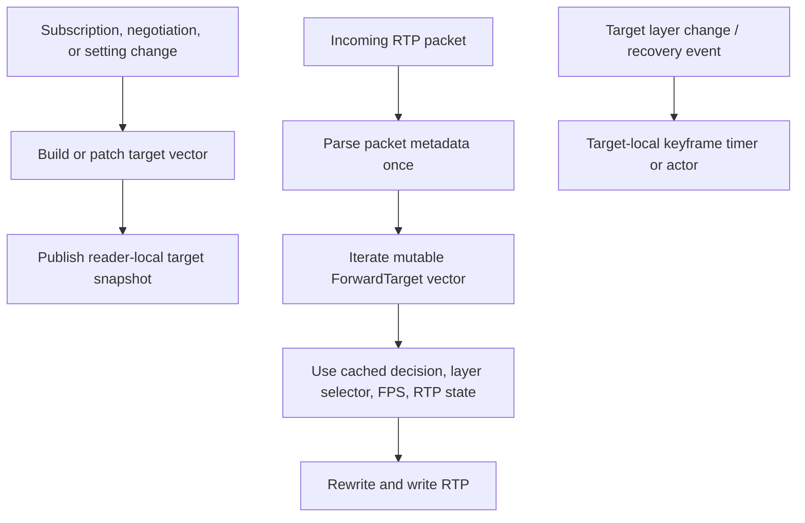

# Forwarding hot-path performance plan

## Status

**Phase 1 complete; further optimization is optional and evidence-driven.** The large simulcast forwarding workloads are functionally healthy and the latest two-round mixed high-simulcast comparison is within 5% CPU of the upstream Go LiveKit reference.

This plan records the evidence, reference behavior, target architecture, staged implementation plan, and completion gates for closing that gap without weakening LiveKit compatibility.

## Problem statement

The benchmark suite compares an upstream Go LiveKit server with OxideSFU under `lk perf load-test`. The large simulcast scenarios are the current CPU outliers:

| Scenario | LiveKit median CPU | OxideSFU median CPU | Observed delta |
|---|---:|---:|---:|
| `video_room_high_simulcast_large` | 3.67 s | 4.51 s | +22.9% |
| `mixed_room_high_simulcast_large` | 7.33 s | 9.54 s | +30.2% |

The workload shapes in `crates/oxidesfu-test/src/benchmark/load.rs` are:

| Scenario | Duration | Video publishers | Audio publishers | Subscribers | Layout | Resolution | Simulcast |
|---|---:|---:|---:|---:|---|---|---|
| `video_room_high_simulcast_large` | 30 s | 3 | 0 | 18 | `3x3` | high | enabled |
| `mixed_room_high_simulcast_large` | 30 s | 4 | 4 | 20 | speaker | high | enabled |

Wall-clock completion remains close to the Go reference and peak RSS is lower. The issue is CPU efficiency in the high-fanout video forwarding path, not a correctness failure or an end-to-end latency regression proven by these artifacts.

## Evidence collected

### Benchmark history

The earlier two-run comparison was above the benchmark's configured 25% CPU regression gate:

```text
OxideSFU median CPU: 9.53 s
LiveKit median CPU:  6.97 s
Gate:                 8.71 s
```

After the reader-local target-state refactor, a fresh two-run comparison completed within the gate:

```text
OxideSFU median CPU: 7.87 s
LiveKit median CPU:  7.53 s
Delta:                +4.5%
OxideSFU peak RSS: 108.95 MiB (Go: 204.54 MiB; -46.7%)
```

These limited samples are useful directionally but are not a stable capacity claim. Use at least five runs on an otherwise idle host for acceptance decisions.

### CPU profiles

The repository-owned runner captures a profileable OxideSFU server and the exact `lk` workload:

```sh
tools/profiling/profile-load-test.sh mixed_room_high_simulcast_large
```

The successful runs delivered all 160 subscriber tracks with zero reported packet loss. The top-level `perf` samples moved as the first forwarding fixes landed:

| Sampled symbol | Initial profile | After revision-scoped cleanup | After target-bound RTP state |
|---|---:|---:|---:|
| `core::hash::sip::Hasher::write` | 12.65% | 7.13% | 6.51% |
| `__vdso_clock_gettime` | 3.20% | 3.03% | 2.74% |
| WebRTC peer-connection `poll_write` | 2.38% | 2.41% | 2.64% |
| forwarding reader closure | 1.11% | 2.16% | 1.70% |
| `String::clone` | 1.57% | 1.23% | 1.21% |
| `BuildHasher::hash_one` | — | — | 1.16% after reader-local target state |

The post-refactor profile delivered all 160 subscriber tracks with zero reported packet loss. Its largest samples were WebRTC peer-connection `poll_write` (3.15%) and `__vdso_clock_gettime` (3.03%); no forwarding map hash operation is a leading hotspot.

Representative artifacts are deliberately ignored under `target/profiles/`; reproduce them rather than committing binary profiling data.

### Findings

The original forwarding reader held several parallel maps indexed by:

```rust
(String, String, String, String)
// room, publisher identity, track SID, subscriber identity
```

It performed membership cleanup, target state lookup, settings revision lookup, and keyframe timing work on media packets. This caused repeated secure hashing, string cloning, map probing, and lock acquisition in the steady RTP path.

The first optimization commit, `55e7751d` (`perf: scope forwarding state to target revisions`), made these changes:

1. Target-state cleanup occurs only when `ForwardTrackStore::revision()` changes.
2. Per-target settings revisions are queried only for new targets or a new global settings generation.
3. The forwarding snapshot stores a `SubscriberRtpForwarder`, avoiding the global `RtpForwardingStore` map lookup for each forwarded RTP packet.
4. Keyframe recovery remains periodic, but target scans occur on target change or a once-per-three-second per-track sweep rather than every video packet.

The implementation initially removed periodic keyframe recovery completely. The real Rust SDK quality-switch contract failed, proving that retries are compatibility behavior, not merely diagnostics. The final design retained throttled recovery.

## Reference map

Reference checkout used: local LiveKit server commit `ae09b7d0ad94d764f0c97d183efd36476163e819`.

### LiveKit server

| Area | Reference files | Behavior derived |
|---|---|---|
| Subscription settings | `pkg/rtc/subscriptionmanager.go`, `pkg/rtc/subscribedtrack.go` | Settings are routed to the individual subscription, compared/debounced, and applied out of band. Applying settings mutates that track's mute and spatial/temporal layer target. |
| Per-subscriber forwarding | `pkg/sfu/downtrack.go`, `pkg/sfu/forwarder.go` | Each subscription has one `DownTrack` and local `Forwarder`; media forwarding uses that target-local state rather than resolving a global compound-key map on every RTP packet. |
| Keyframe recovery | `pkg/sfu/downtrack.go` | Each video DownTrack owns a channel/timer-driven keyframe requester. Layer changes signal the worker; retry cadence is bounded using RTT-derived timing. |
| Packet lifecycle | `pkg/sfu/downtrack.go`, `pkg/sfu/buffer/buffer_base.go`, `pkg/sfu/pacer/base.go` | Ext-packet wrappers, RTP headers, payload buffers, and pacer packets are pooled. Packet sending returns borrowed resources to their pools. |

### Pion WebRTC

Reference checkout: `webrtc_pion/` in this workspace.

| Area | Reference files | Behavior derived |
|---|---|---|
| Local RTP write | `track_local_static.go` | `TrackLocalStaticRTP::WriteRTP` obtains a pooled packet and iterates its negotiated bindings under a track-local read lock. Each binding already contains SSRC, payload type, and write stream. |
| Interceptor dispatch | `interceptor.go` | The RTP writer is held in an atomic value and forwards a header/payload directly through the interceptor chain. |
| Transport write | `dtlstransport.go` | Transport owns SRTP/SRTCP sessions and write streams; packet-level consumers should not re-resolve transport identity. |

### Derived rule

Use Go/LiveKit as the behavior specification, not as a file-layout template. The Rust implementation should preserve the same ownership boundary:

> Subscription and layer policy update target-local state. RTP forwarding reads target-local state.

## Current OxideSFU architecture

Relevant implementation files:

- `crates/oxidesfu-signaling/src/router/session.rs` — publisher reader and RTP forwarding loop.
- `crates/oxidesfu-signaling/src/stores/forwarding.rs` — active forwarding target store and revision.
- `crates/oxidesfu-signaling/src/media/rtp_forwarding.rs` — sequence/timestamp rewriting, retransmission state, sender report mapping, and feedback state.
- `crates/oxidesfu-signaling/src/media/track_settings.rs` — canonical settings and debounce state.
- `crates/oxidesfu-signaling/src/media/video_ingress.rs` — per-subscriber simulcast SSRC selection.

The reader caches active targets and their `SubscriberRtpForwarder` handles on `ForwardTrackStore` revision changes. `ForwardTarget` now owns the forwarding decision, selector, settings revision, FPS state, target SSRC/payload-type cache, keyframe timestamp, first-forward/drop flags, and write-error counts. A revision refresh preserves state for still-active targets and drops removed targets with the old vector entry.

The remaining packet-loop store query is the global track-settings generation check. It is not a dominant profile sample after Phase 1, but Phase 2 remains the path to eliminate it if a future benchmark or profile proves it worthwhile.

## Target architecture

Introduce a private, reader-owned target object. Names are illustrative; the final Rust API should remain private or `pub(crate)`.

```rust
struct ForwardTarget {
    // Control-plane identity; never reconstructed in the RTP loop.
    key: ForwardTrackKey,

    // Negotiated output resources.
    local_track: LocalRtpTrack,
    rtp_forwarder: SubscriberRtpForwarder,

    // Cached policy and negotiated output state.
    decision: CachedForwardingDecision,
    settings_revision: Option<u64>,
    target_ssrc: Option<Option<u32>>,
    payload_type: Option<Option<u8>>,

    // Per-target media state.
    layer_selector: SubscriberVideoLayerSelector,
    fps_state: FpsForwardingState,
    last_keyframe_request_at: Option<Instant>,

    // Bounded diagnostics / lifecycle state.
    forwarded_once: bool,
    rewrite_drop_logged: bool,
    write_error_count: u64,
}
```

The publisher reader owns a compact `Vec<ForwardTarget>`, refreshed only when target membership or negotiated output changes.



### Packet-loop invariants

The steady RTP loop must not:

- construct or hash room/publisher/track/subscriber strings;
- query `TrackSettingsStore` for every packet;
- scan global target maps for stale state;
- look up a target's RTP state in a global map;
- perform one clock query per target;
- allocate packet-policy objects.

It may:

- iterate the active target vector;
- obtain target-local locks where correctness requires shared RTCP/retransmission access;
- clone an RTP payload only where output packet ownership requires it;
- write through the negotiated WebRTC sender.

## Implementation phases

### Phase 0 — Preserve baseline and contracts

- Keep known profiles as local before artifacts.
- Run `cargo test -p oxidesfu-signaling`.
- Run `cargo test -p oxidesfu-test rust_sdk_room_simulcast_video_quality_switch_preserves_video_delivery_contract -- --nocapture`.
- Run `tools/profiling/profile-load-test.sh mixed_room_high_simulcast_large`.

Do not begin a phase without a current successful media delivery contract. A profile with missing tracks is not a valid performance comparison.

### Phase 1 — Reader-local target state

**Status: complete in the current working tree.**

**Objective:** replace parallel per-target maps in `forward_publisher_remote_track` with `ForwardTarget` fields.

1. Add focused unit tests for target rebuild and removal:
   - removing a target drops only its state;
   - preserving a target preserves sequence/timestamp rewrite state;
   - changing one target's settings resets only that selector/FPS state;
   - target identity is retained for diagnostics without packet-path cloning.
2. Build `Vec<ForwardTarget>` on forwarding revision change.
3. Move target SSRC, payload type, selector, FPS, decision, logging flags, and write errors into the struct.
4. Preserve shared `SubscriberRtpForwarder` state so RTCP retransmission and sender-report mapping remain coherent.
5. Delete the superseded parallel maps only after the contracts pass.

**Result:** the steady target iteration has no compound-key `HashMap` lookup. The only shared state retained is the target-bound `SubscriberRtpForwarder`, which is intentionally shared with RTCP retransmission and sender-report handling. Validation: `cargo test -p oxidesfu-signaling` (484 passed, 3 ignored); Rust SDK simulcast quality-switch contract passed; the two-run benchmark recorded +4.5% CPU vs Go with all 160 tracks delivered and zero loss.

**Acceptance:** no compound-key `HashMap` lookup in the steady target iteration except explicitly retained shared RTCP state.

### Phase 2 — Event-driven settings propagation

**Objective:** make settings application update only the affected `ForwardTarget`.

1. Keep `TrackSettingsStore` as canonical/debounce storage.
2. On an effective settings update, notify the affected reader/target through a bounded channel or revision event.
3. Resolve quality/FPS once at update time and store the effective values on the target.
4. Reset selector/FPS state only for that target.
5. Avoid global generation scans over every target if a targeted event is available.

Use an actor-like reader command channel if it keeps ownership local and avoids shared mutable state. Do not add a global singleton or broaden public API merely to optimize this path.

**Acceptance:** a normal RTP packet performs no `TrackSettingsStore` lookup or mutex acquisition.

### Phase 3 — Target-local keyframe acquisition actor

**Objective:** mirror LiveKit's event/timer model without copying Go structure.

1. Create a bounded notification path for target add, target layer change, and recovery events.
2. Coalesce duplicate notifications.
3. Request PLI only while target acquisition is incomplete or recovery requires it.
4. Use a bounded retry interval; derive RTT-aware policy only after metrics exist and tests specify it.
5. Ensure reader and target teardown cancels the task without leaks.

**Acceptance:** no periodic keyframe map scan in the media packet loop; Rust SDK quality switching remains reliable.

### Phase 4 — Packet ownership and write-path allocation audit

**Objective:** reduce allocation/copy pressure after state lookup is fixed.

1. Capture Heaptrack under the same workload.
2. Attribute allocations to packet clone, RTP extension injection, payload construction, retransmission cache, and WebRTC writes.
3. Reuse existing `Bytes`, buffer, or WebRTC APIs before introducing a pool.
4. Add a pool only with a bounded lifetime, explicit ownership, and a profile proving allocator pressure is material.
5. Do not introduce `unsafe` to imitate Go pools.

**Acceptance:** a before/after Heaptrack comparison shows a reduction in a measured allocation hotspot, with no new memory retention regression.

## Post-Phase-1 profile and remaining optimization map

The latest Oxide-only `mixed_room_high_simulcast_large` profile used WebRTC fork `4913263432b9f6ba38a1b06ff1fc3672cfba40fc`, delivered all 160 subscriber tracks, and reported zero packet loss. Its leading samples are now below the signaling target-selection layer:

| Sampled symbol | CPU sample |
|---|---:|
| RTC core `RTCPeerConnection::poll_write` | 3.32% |
| `__vdso_clock_gettime` | 3.02% |
| WebRTC peer-connection driver event loop | 1.88% |
| `BuildHasher::hash_one` | 1.34% |
| `SipHash::write` | 1.18% |
| Oxide publisher forwarding reader | 1.00% |

The WebRTC fork now reuses the driver-owned core-output `Vec<TaggedBytesMut>` batch. The current OxideSFU pin is `ef1e77dbb5e59942fdc3bef1ab5114618f9ac82e`, which also carries RTC commit `fb25d55238c8a534c3b69a5b8842cbbbe0ff7331`: already-marshaled RTP is encrypted in its existing `BytesMut` for AEAD AES-GCM instead of being copied to a second full-packet buffer. The new SRTP regression proves allocation identity, ciphertext equivalence, and successful decryption.

### Remaining opportunities, in priority order

1. **RTC `poll_write` retry ownership design.** The profile still samples `RTCMessageInternal::clone`; it is the generic retry copy made before every handler call. No current handler returns `ErrBufferFull`, but removing the copy without redesigning handler ownership would drop a future backpressured packet. Replace it only with a design that returns the unconsumed message on backpressure, plus ordering/backpressure tests.
2. **Bound writer / driver-hop experiment.** Pion binds an RTP writer to each sender and writes directly through its interceptor chain. Rust currently uses a track-to-driver event hop, followed by a core mutex and later flush. Removing that hop is high-risk ownership work and must be a separate WebRTC-fork design with ordering, backpressure, renegotiation, and disconnect tests.
3. **Timer attribution.** Attribute `clock_gettime` by caller before changing timers. It may be Tokio, ICE/DTLS, RTCP/SRTP, or forwarding diagnostics. The per-target PLI sweep has already been removed.
4. **Event-driven settings propagation.** LiveKit applies debounced settings to an individual `SubscribedTrack`, not in its packet loop. OxideSFU still reads the global settings generation per packet; replace it with a reader-target notification only if a focused profile makes it material.
5. **MID extension and packet-header reuse.** The current cached-MID fast path avoids generic extension marshalling. Profile its remaining extension storage and packet/header clones before considering bounded, owner-local reuse. Do not introduce an unbounded global pool or `unsafe`.

### Reference evidence for the remaining work

- LiveKit `ae09b7d0ad94d764f0c97d183efd36476163e819`:
  - `pkg/rtc/subscribedtrack.go` applies settings to its `DownTrack` outside packet delivery.
  - `pkg/sfu/downtrack.go` owns target-local forwarding and recovery state.
- Pion `6fbce156e0de9764f1ce46ac581c0469ec1d7a04`:
  - `track_local_static.go` uses a pooled shallow RTP packet and target-bound writers.
  - `rtpsender.go` binds the interceptor/SRTP writer once.
  - `interceptor.go` dispatches through the bound writer without a peer-connection driver event queue.
- OxideSFU WebRTC fork `ef1e77dbb5e59942fdc3bef1ab5114618f9ac82e` (the preceding profile used `4913263432b9f6ba38a1b06ff1fc3672cfba40fc`):
  - `src/media_stream/track_local/static_rtp.rs` has cached-MID injection and a driver event enqueue.
  - `src/peer_connection/driver.rs` owns event delivery, core locking, batch draining, and socket writes.
  - `rtc/rtc/src/peer_connection/handler/mod.rs` owns core `poll_write` retry and temporary queues.
  - RTC `fb25d55238c8a534c3b69a5b8842cbbbe0ff7331` consumes the RTP marshal buffer in `rtc-srtp/src/context/srtp.rs` and `cipher/cipher_aead_aes_gcm.rs`.

### Final two-round comparison and current limit

The final benchmark command was:

```sh
OXIDESFU_ENABLE_BENCHMARKS=1 OXIDESFU_BENCHMARK_MODE=full OXIDESFU_BENCHMARK_RUNS=2 \
  cargo test -p oxidesfu-test benchmark_compare_mixed_room_high_simulcast_large_cpu_rss -- --nocapture
```

At OxideSFU `1bad531e`, the median `mixed_room_high_simulcast_large` result was wall time `32.451s` versus Go `32.468s` (`-0.1%`), CPU `7.920s` versus Go `7.080s` (`+11.9%`), and peak RSS `107.996MiB` versus Go `216.305MiB` (`-50.1%`). The two-round CPU gate passed, but two samples do not establish a stable capacity claim; use an otherwise idle host and five rounds before publishing one.

The final Oxide-only video profile delivered `54/54` tracks with zero loss. Its top user-space costs remain AEAD GCM authentication (`Polyval::mul` 3.43%), RTC `poll_write` (3.32%), and the WebRTC driver loop (2.02%). The profile also attributes substantial execution to local loopback UDP/kernel networking; it is not evidence that application-level forwarding alone can close the remaining Go CPU delta.

### Phase 5 — WebRTC and transport investigation

**Objective:** separate OxideSFU-specific overhead from `webrtc-rs` behavior.

1. Profile direct RTP forwarding with minimal signaling policy.
2. Compare symbols under `webrtc::peer_connection` / `rtc::peer_connection` write path.
3. Inspect the pinned `webrtc-rs` fork only after application packet-path work is removed from the profile.
4. Add an upstream fork regression test before changing the pinned dependency.

**Acceptance:** any WebRTC fork patch has a focused test, recorded fork commit, and OxideSFU compatibility validation.

## Test strategy

### Unit tests

Keep tests next to the targeted ownership boundary:

- target rebuild and state retention;
- per-target quality/FPS reset isolation;
- target removal cleanup;
- keyframe event coalescing and retry timing;
- RTP sequence/timestamp continuity through target rebuild;
- retransmission state remains visible to RTCP after target-local handle caching.

### Compatibility contracts

Use the existing Rust SDK contract as the minimum required real-client check:

```sh
cargo test -p oxidesfu-test \
  rust_sdk_room_simulcast_video_quality_switch_preserves_video_delivery_contract \
  -- --nocapture
```

Also retain browser quality-churn coverage when changing layer/keyframe behavior:

```sh
OXIDESFU_URL=ws://127.0.0.1:7880 \
OXIDESFU_API_KEY=devkey \
OXIDESFU_API_SECRET=secret \
npm --prefix crates/oxidesfu-test/browser run test:firefox
```

### Performance validation

Run a profile before and after each focused phase:

```sh
tools/profiling/profile-load-test.sh mixed_room_high_simulcast_large
```

Then run a two-round exploratory comparison:

```sh
OXIDESFU_ENABLE_BENCHMARKS=1 \
OXIDESFU_BENCHMARK_MODE=full \
OXIDESFU_BENCHMARK_RUNS=2 \
cargo test -p oxidesfu-test \
  benchmark_compare_mixed_room_high_simulcast_large_cpu_rss -- --nocapture
```

Use five rounds for an acceptance decision:

```sh
OXIDESFU_ENABLE_BENCHMARKS=1 \
OXIDESFU_BENCHMARK_MODE=full \
OXIDESFU_BENCHMARK_RUNS=5 \
cargo test -p oxidesfu-test \
  benchmark_compare_mixed_room_high_simulcast_large_cpu_rss -- --nocapture
```

The benchmark currently fails its configured 25% CPU gate. Do not suppress or loosen the gate to make a change pass.

## Completion criteria

This work is complete only when all conditions are true:

1. The steady RTP path owns compact per-target runtime state and does not use compound string-key map lookups for normal forwarding policy/state.
2. Settings and keyframe behavior are event-driven or bounded timer-driven, not packet-polling driven.
3. Rust SDK simulcast quality-switch delivery passes.
4. Browser adaptive quality churn passes when the browser environment is available.
5. `cargo test -p oxidesfu-signaling` passes.
6. A five-run large simulcast comparison is within the configured CPU regression gate, or an explicit measured compatibility/performance delta is documented and accepted.
7. A before/after flamegraph and benchmark artifact demonstrate the dominant target hotspot was removed rather than merely displaced.
8. Any `webrtc-rs` dependency change is pinned, tested in its fork, and recorded in the related commit.

## Non-goals

- Mechanical translation of LiveKit Go types or file structure.
- Premature replacement of SipHash with a faster global hasher.
- Global mutable singletons for target state.
- Unsafe packet pools or raw pointer ownership shortcuts.
- Changing client protocol behavior merely to improve the benchmark.

## Session and commit discipline

Each implementation phase should be a focused commit with:

- the specific reference files and commit IDs inspected;
- tests added before behavior;
- profile artifact location/summary;
- benchmark commands and outcomes;
- any known remaining hotspot and the next concrete phase.

The profiling runner and this plan are intentionally separate from release artifacts. `target/profiles/` and benchmark JSON/Markdown are local evidence; commits should preserve the commands, summary metrics, and conclusions needed to reproduce them.
